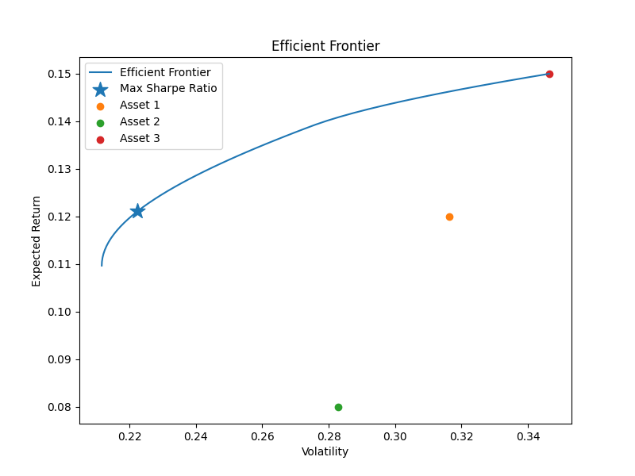

# Python 笔试解答报告

## 第一题：欧式看涨期权定价

### 参数设定

| 符号 | 数值 | 含义 |
|------|------|------|
| $S_0$ | 100 | 标的资产现价 |
| $K$ | 105 | 行权价 |
| $r$ | 0.05 | 无风险利率 |
| $\sigma$ | 0.2 | 波动率 |
| $T$ | 1 | 到期时间（年） |

### 方法一：Black-Scholes 解析解

$$C = S_0 \cdot N(d_1) - K e^{-rT} \cdot N(d_2)$$

其中

$$d_1 = \frac{\ln(S_0/K) + (r + \sigma^2/2) T}{\sigma\sqrt{T}}, \quad d_2 = d_1 - \sigma\sqrt{T}$$

```python
# p1_european_call_option/main.py

import math, random, statistics

# 标准正态分布累积分布函数
def normal_cdf(x):
    return 0.5 * (1 + math.erf(x / math.sqrt(2)))

# Black-Scholes 欧式看涨期权解析解
def black_scholes_call(S, K, r, sigma, T):
    d1 = (math.log(S / K) + (r + 0.5 * sigma ** 2) * T) / (sigma * math.sqrt(T))
    d2 = d1 - sigma * math.sqrt(T)
    return S * normal_cdf(d1) - K * math.exp(-r * T) * normal_cdf(d2)

# Monte Carlo 模拟：生成 N 条风险中性路径，计算收益折现值
def monte_carlo_call(S, K, r, sigma, T, N=100000):
    payoffs = []
    for _ in range(N):
        Z = random.gauss(0, 1)
        S_T = S * math.exp((r - 0.5 * sigma ** 2) * T + sigma * math.sqrt(T) * Z)
        payoff = max(S_T - K, 0)
        payoffs.append(payoff)
    mean_payoff = statistics.mean(payoffs)
    std_payoff = statistics.stdev(payoffs)
    mc_price = math.exp(-r * T) * mean_payoff
    mc_std = std_payoff / math.sqrt(N)
    return mc_price, mc_std

if __name__ == "__main__":
    S, K, r, sigma, T = 100, 105, 0.05, 0.2, 1
    bs_price = black_scholes_call(S, K, r, sigma, T)
    mc_price, mc_std = monte_carlo_call(S, K, r, sigma, T)

    print(f"BS Price   : {bs_price:.6f}")
    print(f"MC Price   : {mc_price:.6f}")
    print(f"MC StdErr  : {mc_std:.6f}")
    print(f"Difference : {abs(bs_price - mc_price):.6f}")
```

### 方法二：Monte Carlo 模拟（$N=10^5$ 条路径）

在风险中性测度下：

$$S_T = S_0 \exp\Bigl((r - \sigma^2/2)T + \sigma\sqrt{T}\,Z\Bigr), \quad Z \sim N(0,1)$$

$$\text{收益}_i = \max(S_T^{(i)} - K,\, 0), \quad C_{MC} = e^{-rT} \cdot \frac{1}{N}\sum_i \text{收益}_i$$

### 计算结果

| 指标 | 数值 |
|------|------|
| Black-Scholes 价格 | **8.021352** |
| Monte Carlo 价格 | **8.022425** |
| MC 标准误差 | **0.043711** |
| 绝对差值 | **0.001073** |
| 相对误差 | **约 0.01%** |

MC 估计值在 1 倍标准误差范围内收敛到 BS 解析解，验证了实现的正确性。

---

## 第二题：投资组合优化（马科维茨均值-方差模型）

### 题目给定数据

**预期收益率：**

$$\boldsymbol{\mu} = [0.12,\; 0.08,\; 0.15]^T$$

**协方差矩阵：**

$$\boldsymbol{\Sigma} =
\begin{bmatrix}
0.10 & 0.02 & 0.03 \\
0.02 & 0.08 & 0.01 \\
0.03 & 0.01 & 0.12
\end{bmatrix}$$

**优化问题：**

$$\max_{\mathbf{w}} \quad \frac{\mathbf{w}^T \boldsymbol{\mu} - r_f}{\sqrt{\mathbf{w}^T \boldsymbol{\Sigma}\,\mathbf{w}}} \quad \text{s.t.} \quad \sum w_i = 1,\; w_i \geq 0$$

其中 $r_f = 0$（题目未给出无风险利率，暂设为 0）。

### 实现代码

```python
# p2_portfolio_optimization/main.py

import numpy as np
from scipy.optimize import minimize
import matplotlib.pyplot as plt

# 计算组合预期收益率：μ_p = wᵀμ
def portfolio_return(weights, mu):
    return weights @ mu

# 计算组合波动率（标准差）：σ_p = sqrt(wᵀΣw)
def portfolio_volatility(weights, sigma):
    return np.sqrt(weights @ sigma @ weights)

# 负风险比率（scipy 只能最小化，故取负）
def neg_sharpe(weights, mu, sigma, rf):
    mu_p = portfolio_return(weights, mu)
    sigma_p = portfolio_volatility(weights, sigma)
    return -(mu_p - rf) / sigma_p

# 求解最小方差组合（有效前沿的左端点）
def min_variance_portfolio(mu, sigma):
    n = len(mu)
    bounds = [(0, None)] * n
    constraints = [{'type': 'eq', 'fun': lambda w: np.sum(w) - 1}]
    res = minimize(portfolio_volatility, np.ones(n)/n, args=(sigma,),
                   method='SLSQP', bounds=bounds, constraints=constraints)
    return res.x

# 求解最大风险比率的最优组合
def optimal_portfolio(mu, sigma, rf):
    n = len(mu)
    bounds = [(0, None)] * n
    constraints = [{'type': 'eq', 'fun': lambda w: np.sum(w) - 1}]
    res = minimize(neg_sharpe, np.ones(n)/n, args=(mu, sigma, rf),
                   method='SLSQP', bounds=bounds, constraints=constraints)
    w = res.x
    return w, portfolio_return(w, mu), portfolio_volatility(w, sigma), (portfolio_return(w, mu)-rf)/portfolio_volatility(w, sigma)

# 计算有效前沿：从最小方差组合开始，扫描各目标收益率
def efficient_frontier(mu, sigma, rf, num_points=50):
    n = len(mu)
    w_mvp = min_variance_portfolio(mu, sigma)
    ret_mvp = portfolio_return(w_mvp, mu)
    target_returns = np.linspace(ret_mvp, np.max(mu), num_points)
    vols, rets = [], []
    for tr in target_returns:
        bounds = [(0, None)] * n
        constraints = [
            {'type': 'eq', 'fun': lambda w: np.sum(w) - 1},
            {'type': 'ineq', 'fun': lambda w, t=tr: float(portfolio_return(w, mu) - t)}
        ]
        res = minimize(portfolio_volatility, np.ones(n)/n, args=(sigma,),
                       method='SLSQP', bounds=bounds, constraints=constraints)
        if res.success:
            rets.append(portfolio_return(res.x, mu))
            vols.append(portfolio_volatility(res.x, sigma))
    return np.array(vols), np.array(rets)

if __name__ == "__main__":
    mu = np.array([0.12, 0.08, 0.15])
    sigma = np.array([[0.10, 0.02, 0.03],
                      [0.02, 0.08, 0.01],
                      [0.03, 0.01, 0.12]])
    rf = 0.0

    w_opt, ret_opt, vol_opt, sharpe_opt = optimal_portfolio(mu, sigma, rf)

    print("=== 最优投资组合 ===")
    for i, w in enumerate(w_opt):
        print(f"资产 {i+1} 权重: {w:.4f}")
    print(f"\n预期收益 : {ret_opt:.4f}")
    print(f"波动率   : {vol_opt:.4f}")
    print(f"风险比率 : {sharpe_opt:.4f}")

    # 绘制有效前沿
    vols, rets = efficient_frontier(mu, sigma, rf)
    plt.figure(figsize=(8,6))
    plt.plot(vols, rets, label="有效前沿")
    plt.scatter(vol_opt, ret_opt, marker="*", s=200, label="最大风险比率", zorder=5)
    asset_vols = np.sqrt(np.diag(sigma))
    for i in range(len(mu)):
        plt.scatter(asset_vols[i], mu[i], label=f"资产 {i+1}", zorder=5)
    plt.xlabel("波动率"); plt.ylabel("预期收益")
    plt.title("有效前沿"); plt.legend()
    plt.savefig("Figure_1.png", dpi=150, bbox_inches='tight')
```

### 步骤说明（按函数复用顺序）

| 步骤 | 函数 | 作用 |
|------|------|------|
| ① 定义收益与风险 | `portfolio_return`, `portfolio_volatility` | 基础模块：$\mu_p = \mathbf{w}^T\boldsymbol{\mu}$，$\sigma_p = \sqrt{\mathbf{w}^T\boldsymbol{\Sigma}\mathbf{w}}$ |
| ② 风险比率取负 | `neg_sharpe` | 将最大化问题转化为 `scipy.optimize.minimize` 可处理的最小化问题 |
| ③ 求最小方差组合 | `min_variance_portfolio` | 有效前沿的左端点（仅最小化风险，不约束收益） |
| ④ 最大化风险比率 | `optimal_portfolio` | 主优化：等式约束 $\sum w_i=1$ + 边界约束 $w_i\geq0$，用 SLSQP 求解 |
| ⑤ 扫描目标收益 | `efficient_frontier` | 对每个 $\mu_\text{target}$（从 MVP 收益到 $\max(\mu)$），求解最小方差 → 得到有效前沿上的 $(\sigma, \mu)$ 点列 |
| ⑥ 绘图 | `matplotlib` | 可视化有效前沿、最优点、各资产独立位置 |

### 计算结果

**最优权重（最大风险比率）：**

| 资产 | 权重 |
|------|--------|
| 资产 1 | **0.3111** |
| 资产 2 | **0.2795** |
| 资产 3 | **0.4094** |

**组合指标：**

| 指标 | 数值 |
|------|-------|
| 预期收益 | **12.11%** |
| 波动率 | **22.24%** |
| 风险比率 | **0.5446** |

**结果分析：**
- 资产 3（预期收益最高 15%，波动率中等）获得最大配置（约 41%）
- 资产 2（预期收益最低 8%）仍获得约 28% 的权重，因其方差低（0.08）且与其他资产协方差较小，具有一定的分散化价值
- 最优组合的风险比率优于任意单资产（单资产风险比率分别为 0.38、0.28、0.43）

### 有效前沿图



有效前沿从左端的最小方差组合（MVP）向右上方延伸，呈凸形曲线。前沿上的每个点都是在给定风险水平下可获得的最高收益，或给定收益水平下的最低风险。

---

## 总结

| 题目 | 方法 | 关键结果 |
|------|------|----------|
| 第一题 — 期权定价 | Black-Scholes 解析解 + Monte Carlo 模拟 | $C_{BS}=8.021$, $C_{MC}=8.022$（相对误差 < 0.01%）|
| 第二题 — 组合优化 | 马科维茨均值-方差模型（SLSQP 数值优化）| 风险比率=0.5446，权重=[0.31, 0.28, 0.41] |
